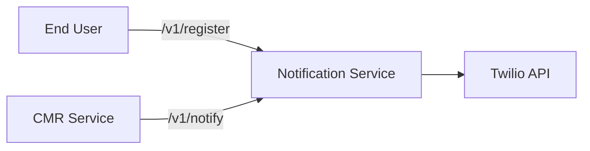

# Hi there! 👋

This is [Reveal-md](https://github.com/webpro/reveal-md), reveal-js on steroids!

- Point 1
- Point 2

[A Link](www.google.com)

---

## Second slide

> Best quote ever.

 <!-- .element style="border: 0; background: None; box-shadow: None" width="100px" -->

Note: speaker notes FTW!

---

## Another slide

```python
def myfunction():
    return True
```

```js [1-2|3|4]
    let a = 1;
    let b = 2;
    let c = x => 1 + 2 + x;
    c(3);
```

----

### Vertical slide A




----

### Vertical slide B

---

## Thank you!
